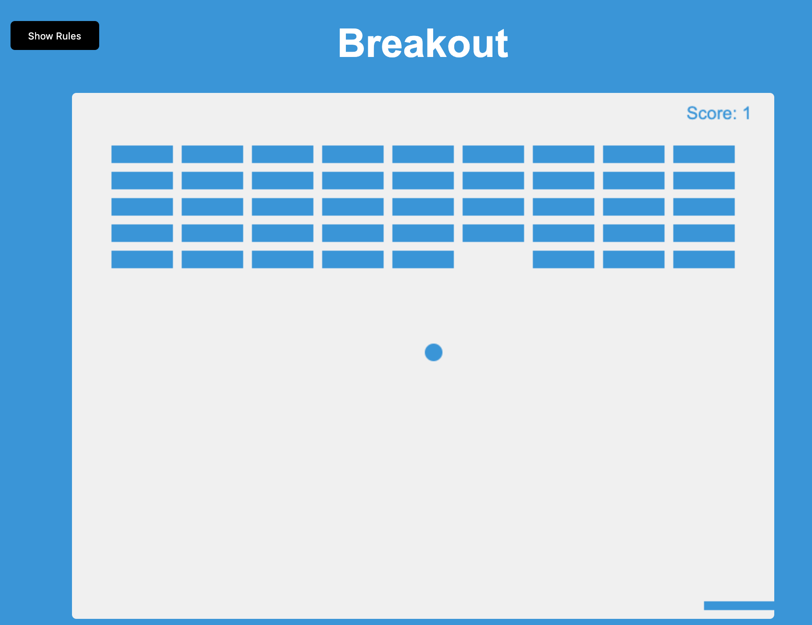

# Breakout
Classic Breakout game using Vanilla JavaScript.

## How to play
Use your right and left keys to move the paddle to bounce the ball up and break the blocks.

If you miss the ball, your score and the blocks will reset.

## Todos
* Customize Colors
* Make a splash screen
* Save high scores to localStorage
* When you lose, stop game and show summary with a start new game button.