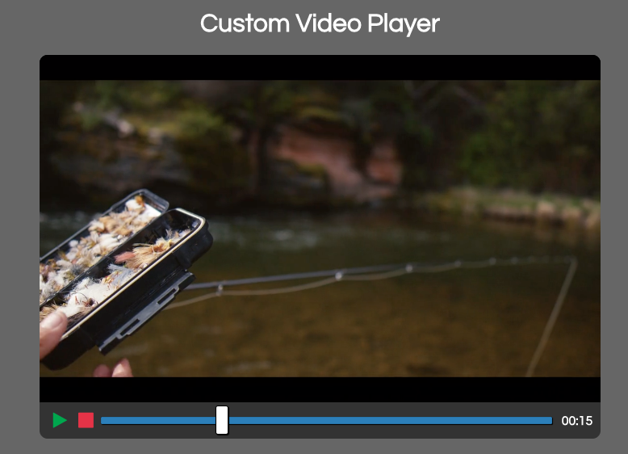

# Custom Video Player
Custom video player using the HTML5 video element and the JavaScript Video and Audio API.

* Play/pause
* Stop
* Progress bar
* Set progress bar time
* Display progress time in mins and seconds

## Whats it look like?

## Resources
* [MDN - Video and Audio APIs](https://developer.mozilla.org/en-US/docs/Learn/JavaScript/Client-side_web_APIs/Video_and_audio_APIs)
* Credit to Brad Traversy and his excellent [Udemy Course](https://www.udemy.com/course/web-projects-with-vanilla-javascript). 