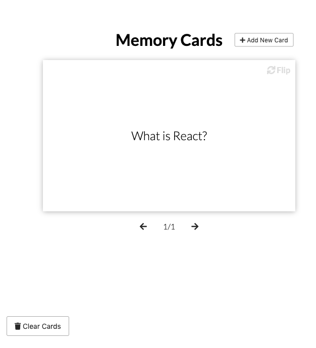
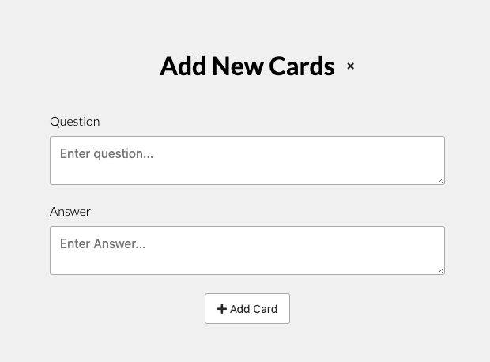

# Memory Cards
A learning tool written in Vanilla JavaScript. 

* Add and retrieves cards using localStorage
* paginates cards
* CSS transitions and animations to make ui transitions look good.

## Whats it look like?

## Add Card
